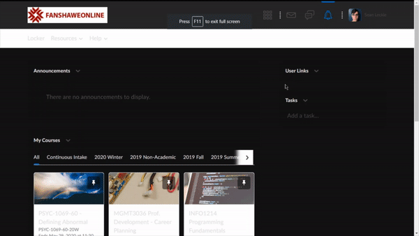

# fanshawe-d2l-dark-mode
 Brightspace didn't want to give us a dark mode, so we made our own.

## Modifying (for contributors) and beta testing (for testers)
 The best way to work with this is using [Brackets](http://brackets.io/), [Just Color Picker](https://annystudio.com/software/colorpicker/) and a web browser of your choice (but I only support Chromium-based browsers for now).
 To import what's already been done into the browser (in Chromium), open up Developer Tools, switch to Sources, open fanshaweonline.ca/d2l/common/css and drop the code into the file it belongs in. The changes should show immediately.
 
## Installing (for end users)
 This will be done using the Stylish extension. The Stylish theme will be published when the theme is somewhat done.

## To-do
 - Check and modify all items listed as `*/edit*/` in the respective files
 - Check all items listed as `*/tweak/*` in the respective files for readability
 - Work on not making Chrome crash when working with Sources (idk)
 - Use [this method](https://css-tricks.com/replace-the-image-in-an-img-with-css/) to replace the shitty banner with a png-ified version.
 - See if there's any way to override the stupid inline js style code
   - remind me to hunt down and kill whoever coded this goddamn system because it's broken and sloppy
   
## Currently working on:
Mainpage! It's about 30% done.
